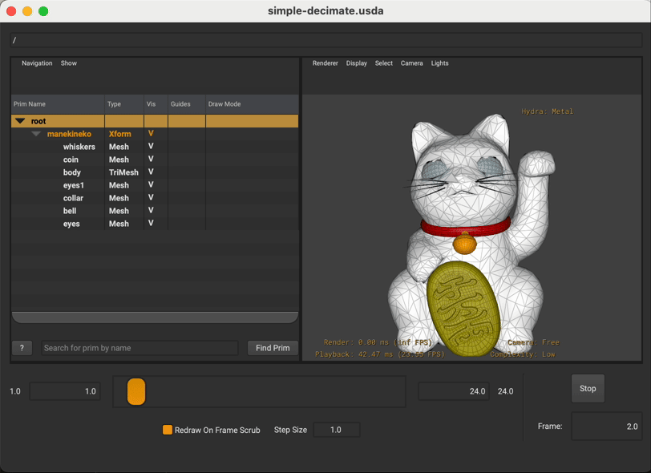

# usd-simple-decimation-schema
An example USD schema/adapter implementing a simple triangular mesh decimation using [libigl](https://github.com/libigl/libigl).



Example "Maneki" animation USD asset made available by [J CUBE](https://j-cube.jp/solutions/multiverse/assets/)

## Prerequisite:
* [Pixar OpenUSD](https://github.com/PixarAnimationStudios/OpenUSD)

## Building the plug-ins
```shell
git clone https://github.com/jerenchen/usd-simple-decimation-schema.git
cd usd-simple-decimation-schema
mkdir build && cd build
cmake -DCMAKE_INSTALL_PREFIX=/path/to/usd/plugins -DCMAKE_BUILD_TYPE=Release ..
make -j8 && make install
```
The content of `/path/to/usd/plugins` should look like this:
```shell
.
└── plugin
    ├── plugInfo.json
    ├── trimesh
    │   └── resources
    │       ├── generatedSchema.usda
    │       └── plugInfo.json
    ├── trimeshImaging
    │   └── resources
    │       └── plugInfo.json
    └── trimeshImaging.dylib
```
Finally, add `/path/to/usd/plugins` to env var `PXR_PLUGINPATH_NAME`.

## Viewing the Demo
Before opening the demo, either download the example USD asset from [here](https://j-cube.jp/solutions/multiverse/assets/) or via CMake:
```shell
cd usd-simple-decimation-schema/demo
mkdir build_demo && cd build_demo && cmake .. && cd ..
```
With both `simple-deciamte.usda` and `maneki_anim.usd` present in the same directory, run the following command to view the demo:
```shell
usdview simple-decimate.usda
```
