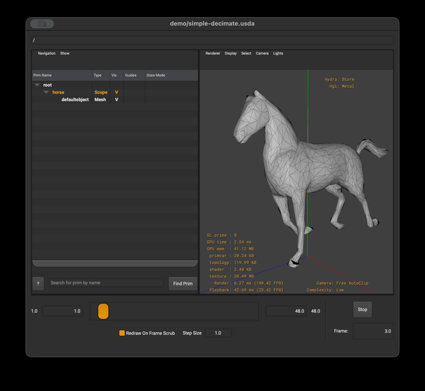

# usd-simple-decimation-schema
An example [OpenUSD](https://github.com/PixarAnimationStudios/OpenUSD) API schema with Hydra 2.0 implementation of a simple mesh decimation USD plugin using [libigl](https://github.com/libigl/libigl).



>> ACKNOWLEDGMENT: The "horse gallop" animation is converted from the example of the *.obj sequence made available by ["Mesh Data from Deformation Transfer for Triangle Meshes"](https://people.csail.mit.edu/sumner/research/deftransfer/data.html).

## News
* 2026-04-10: Hydra 2.0 reimplementation with Pixi env manager
* 2024-06-20: Initial implementation using USD Imaging scene delegate (Hydra 1.0/Legacy)

## Prerequisite
* [Pixi](https://pixi.prefix.dev/) for building the plugin & running the demo

## Build
>> NOTE: This project is set up for *MacOS*; support for *Linux* may be added in the future

```shell
git clone https://github.com/jerenchen/usd-simple-decimation-schema.git
cd usd-simple-decimation-schema
pixi run build-plugin
```

## Demo
To download and convert the horse gallop animation into a USD scene, run:
```shell
pixi run build-demo
```
Once done, run the following command to view the demo:
```shell
pixi run view-demo
```

## More...
* Only the "codeless" schema is generated for this example but full Python support for the API schema can be implemented by following the steps described in [USD-Cookbook: Custom schema with Python binding](https://github.com/ColinKennedy/USD-Cookbook/tree/master/plugins/custom_schemas_with_python_bindings)